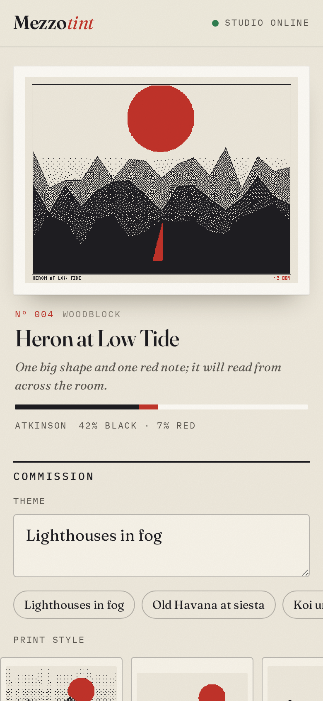
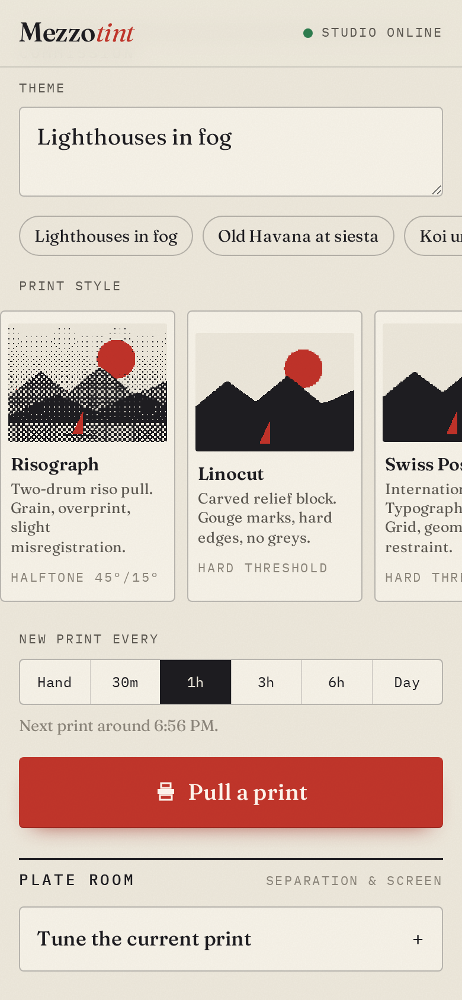
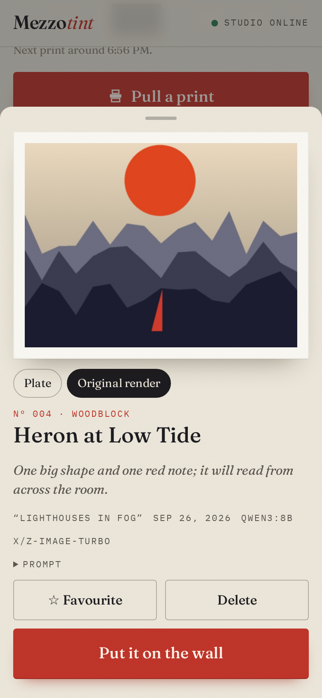
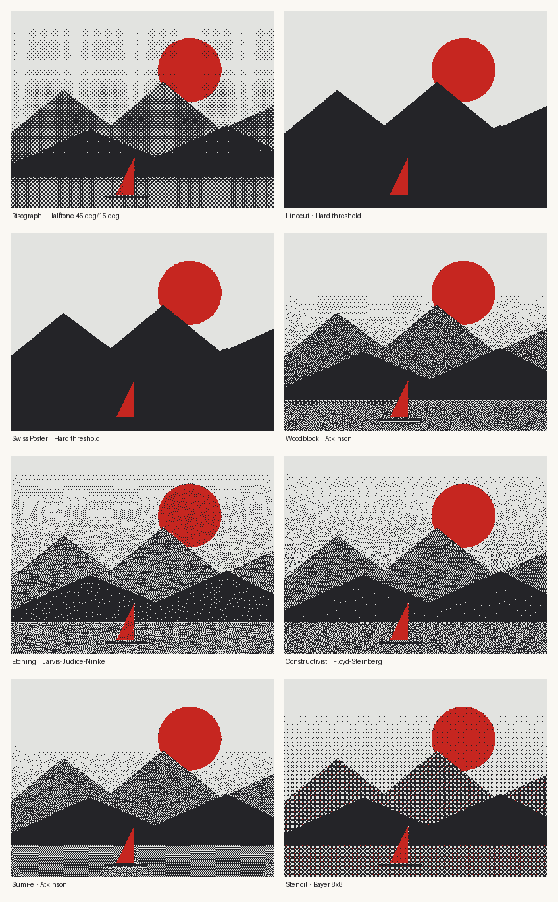
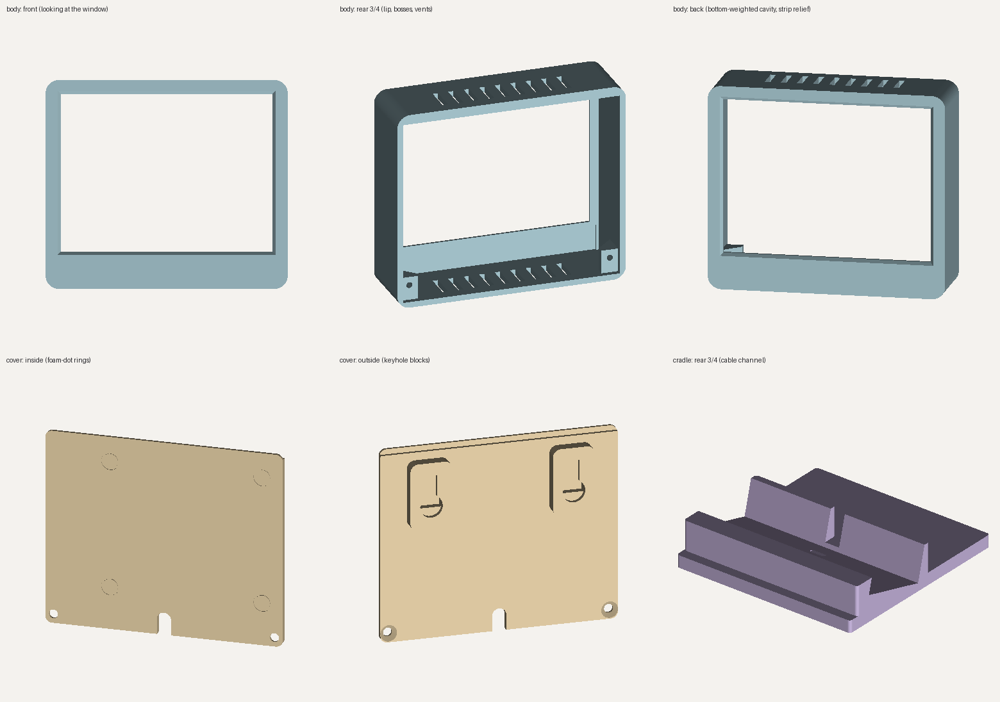
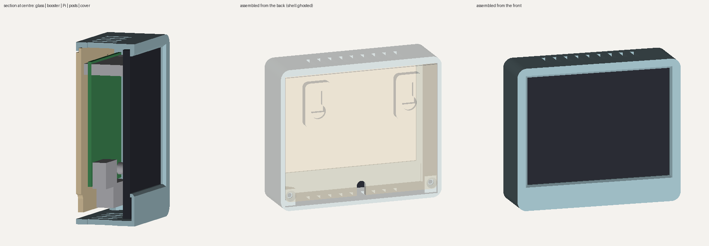

# Mezzotint

[](https://github.com/vturrojas/mezzotint/actions/workflows/tests.yml)

An AI print studio for a three-ink e-paper frame.

A Raspberry Pi with a Pimoroni Inky wHAT (red) hangs on the wall. From your phone you give it a theme and a print style. A Mac in the house art-directs with a local LLM (Ollama) and draws a new image with a local diffusion model (mflux on Apple's MLX), and the Pi separates it into black, red and paper like a two-colour press would, then prints it to the panel. Every print is numbered, titled and archived.

Nothing leaves your network. There are no API keys and no cloud bill.

Mezzotint is inspired by [portrayt](https://github.com/apockill/portrayt) by [apockill](https://github.com/apockill).

| The wall | Commission | Original render vs. plate |
|---|---|---|
|  |  |  |



---

## What makes it good

**It designs for three inks instead of hoping.** Most e-ink photo frames take a full-colour image and dither it at the end, which turns every photo into red-speckled mud. Mezzotint works backwards from the panel:

- The **art director** (a local LLM) turns a loose theme into one specific scene composed for a 400×300, three-ink print: a strong silhouette, flat fields, generous paper, and red reserved for one or two things that deserve it. It titles the print, writes a one-line note on why, and avoids repeating recent prints.
- The **style directive** (risograph, linocut, Swiss poster, woodblock, etching, constructivist, sumi-e, stencil) is appended to every image prompt in code, so the look holds even when the LLM drifts.
- The **ink engine** separates colour like a print shop: it measures each pixel's lightness and how close its hue is to vermilion in CIELAB space, so reds and warm oranges go to the red plate while blues and greens become neutral black screens instead of stray red dots.
- Each style is paired with the **screen** that suits it: a rotated clustered-dot halftone (black at 45°, red at 15°, like a real two-drum riso) for Risograph, a hard threshold for Linocut, Jarvis error diffusion for Etching, Atkinson for Woodblock, and so on.
- Prints are **mounted**: full bleed, a plate mark, or matted with a pixel-type colophon (title in black, edition number in red).

**It is a tool a designer can actually drive.** The Plate room re-separates the current print live on the phone with any screen, red strength, contrast, shadows, sharpening and mount, before you commit an e-ink refresh. The archive keeps the original full-colour render next to every plate, so you can flip between what the model drew and what the press made of it.

**It keeps working when the Mac sleeps.** The frame rotates your starred prints until the studio is back, and respects quiet hours.

---

## How it fits together

```
 phone ──http──▶  Raspberry Pi 3A+  "mezzotint.local"          Mac "studio-mac"
                  ┌──────────────────────────────┐   bearer    ┌───────────────────────────┐
                  │ Frame (FastAPI, port 80)     │   token     │ Studio (FastAPI, :8765)   │
                  │  • phone app + archive       │ ──────────▶ │  • art director (LLM)     │
                  │  • scheduler, quiet hours    │  POST       │  • image model (mflux)    │
                  │  • ink engine (NumPy)        │  /render    │        │                  │
                  │  • Inky wHAT driver          │ ◀────────── │        ▼                  │
                  └──────────────────────────────┘   PNG +     │  Ollama on localhost only │
                                                     title     └───────────────────────────┘
```

The Pi does no AI work. The Mac does no display work. Ollama stays bound to localhost; only the studio is exposed on your LAN, behind a random token generated at install.

---

## Hardware

- Raspberry Pi 3 A+ (512 MB is plenty). A 3 B+, 4 or Zero 2 W also runs the software; the case is drawn for the A+.
- Pimoroni **Inky wHAT, red/black/white** (400×300). The older pHAT (212×104 / 250×122) also works; the engine reads the resolution from the board.
- microSD card: **8 GB is enough, 16 GB is comfortable.** Raspberry Pi OS Lite plus Mezzotint uses about 3 GB, and each archived print is roughly 150 KB. Keep the 64 GB card for something hungrier.
- A Mac with Apple Silicon (16 GB+) for the studio. Images are drawn by [mflux](https://github.com/filipstrand/mflux) running Z-Image Turbo in 4-bit (about 6 GB, downloaded once from Hugging Face). The art director runs in Ollama.

> **Why not Ollama for images?** Ollama shipped experimental image generation in January 2026 and then disabled it in 0.32.6 ([ollama#17893](https://github.com/ollama/ollama/issues/17893)). It still lists and downloads image models but refuses to run them. The studio can use Ollama again for images later with `MEZZOTINT_IMAGE_BACKEND=ollama`.

---

## Setup

### 1. The Mac (studio)

1. Install Ollama from https://ollama.com/download and open it once.
2. Clone this repo and run:

   ```bash
   ./deploy/mac/install.sh
   ```

   It pulls an art-director LLM sized to your RAM, installs mflux, downloads Z-Image Turbo and draws a smoke-test image, generates a token, and installs a LaunchAgent so the studio starts at login. It finishes by printing the exact command to run on the Pi. If macOS asks whether Python may accept incoming connections, allow it.

   Override choices with environment variables, e.g. `LLM=gemma3:4b ./deploy/mac/install.sh`.

### 2. The SD card

In Raspberry Pi Imager choose **Raspberry Pi OS Lite (64-bit)**. In the settings gear: hostname `mezzotint`, your Wi-Fi, a username, and enable SSH. Flash, seat the wHAT on the GPIO header, and boot.

### 3. The Pi (frame)

```bash
ssh <you>@mezzotint.local
git clone <this repo> mezzotint && cd mezzotint
./deploy/pi/install.sh --studio http://studio-mac.local:8765 --token <token-from-the-mac>
```

It enables SPI and I2C, adds the `spi0-0cs` overlay the Inky needs, installs into a virtualenv, writes `/etc/mezzotint/frame.env`, caps the system journal to spare the SD card, and installs a systemd service. It reboots if the SPI settings changed.

When it comes back, the panel prints a **QR code**. Scan it.

### 4. The phone

Open `http://mezzotint.local/` (or scan the QR). On iPhone, Share → **Add to Home Screen**; on Android, menu → **Add to Home screen**. It opens full-screen like an app.

Type a theme, pick a style, choose a cadence, and **Pull a print**. The first print after the Mac boots takes longer while models load.

---

## Using it

- **Theme** is a mood, not a picture. "Lighthouses in fog", "Old Havana at siesta", "Botanical studies of chili peppers". Each pull commits to a different scene inside it.
- **Print style** sets both the art direction and the screen. The swatches in the picker are real plates from the ink engine.
- **New print every** Hand (manual only), 30 min, 1 h, 3 h, 6 h or daily.
- **Plate room** re-separates the current print on the phone as you move the controls. *Print this proof* sends it to the wall. *Make default* applies those plate settings to future prints. *Reset to style* goes back to the style's own plate.
- **Archive** tap any print for its title, note, prompt and the original render. Star favourites; they rotate on the wall while the Mac sleeps.
- **Frame** section: quiet hours, the rotation switch, studio status, and *Show QR on frame* for guests.

A red tri-colour panel takes around 20–30 seconds to refresh and flashes while it does. That is normal.

### Proof sheets

Compare every style or every screen on any image, at any panel size:

```bash
mezzotint-proof my-photo.jpg --by style  -o styles.png
mezzotint-proof my-photo.jpg --by screen -o screens.png --size 400x300
```

### Try it without hardware

```bash
pip install -e ".[dev]"
./tools/dev.sh        # fake Ollama + studio + frame with a virtual panel
open http://localhost:8080
```

To use real models from a laptop, set `OLLAMA_URL=http://127.0.0.1:11434` for the studio line in `tools/dev.sh`.

---

## The case

`case/` has a parametric enclosure you print in one colour (build123d): a slim bezel with a 45° mat bevel, weighted at the bottom like a gallery mat; a back cover with keyholes for wall hanging; and a desk cradle that leans the frame back 15°. It measures 96 × 83 × 28 mm and needs no supports. There is also a quick fit-test ring to print before the long job. [Print settings, hardware and assembly →](case/README.md)




---

## Configuration

**Frame** (`/etc/mezzotint/frame.env` on the Pi)

| Variable | Default | |
|---|---|---|
| `MEZZOTINT_STUDIO_URL` | `http://studio-mac.local:8765` | Where the studio lives |
| `MEZZOTINT_TOKEN` | | Must match the Mac |
| `MEZZOTINT_PANEL` | `auto` | `what-red` or `phat-red` if the board has no EEPROM |
| `MEZZOTINT_DISPLAY` | `auto` | `virtual` writes PNGs instead of driving a panel |
| `MEZZOTINT_DATA` | `~/mezzotint-data` | Settings and archive |
| `MEZZOTINT_FRAME_PORT` | `80` | |

**Studio** (`~/.mezzotint/studio.env` on the Mac)

| Variable | Default | |
|---|---|---|
| `MEZZOTINT_LLM` | `auto` | Any Ollama text model; `auto` prefers qwen3, then gemma3, llama3 |
| `MEZZOTINT_IMAGE_BACKEND` | `mflux` | `ollama` once Ollama re-enables image generation |
| `MEZZOTINT_IMAGE_MODEL` | `filipstrand/Z-Image-Turbo-mflux-4bit` | Any Z-Image Turbo checkpoint mflux can load |
| `MEZZOTINT_IMAGE_SIZE` | `1024x768` | 4:3 to match the wHAT |
| `MEZZOTINT_PORT` | `8765` | |

After editing, restart: `sudo systemctl restart mezzotint-frame` on the Pi; `launchctl kickstart -k gui/$(id -u)/com.mezzotint.studio` on the Mac.

---

## Security notes

- Ollama is never exposed; the studio talks to it on `127.0.0.1`.
- The studio requires a 192-bit bearer token and refuses to start without one. Comparison is constant-time.
- The frame's phone app has no login. Anyone on your Wi-Fi can change the theme. If that matters on your network, put the Pi on a trusted VLAN or add a reverse proxy with auth.
- The frame runs as your user with only `CAP_NET_BIND_SERVICE` added, `NoNewPrivileges`, and a read-only system.

---

## Troubleshooting

| Symptom | Fix |
|---|---|
| `Chip Select … claimed by spi0 CS0` | `dtoverlay=spi0-0cs` missing from `/boot/firmware/config.txt`; the installer adds it. Reboot. |
| `No EEPROM detected` | Check SPI/I2C are on (`sudo raspi-config`), or set `MEZZOTINT_PANEL=what-red`. |
| Phone says *studio asleep* | The Mac is asleep or the studio is stopped. Check `~/.mezzotint/logs/studio.log`. To keep it awake on power: `sudo pmset -c sleep 0`. |
| First print is slow | Models load into memory on first use after a reboot. Later prints are much faster. |
| `mezzotint.local` doesn't resolve | Some Android builds lack mDNS. Use the Pi's IP address, or set a DHCP reservation. |
| Frame logs | `journalctl -u mezzotint-frame -f` |

---

## Development

```bash
pip install -e ".[dev]"
pytest            # 55 tests: ink engine, studio (mocked Ollama), frame pipeline, scheduler
```

Layout:

```
src/mezzotint/
  ink.py              separation, screens, mounting, pixel type, QR welcome card
  styles.py           art direction + plate pairings
  proof.py            sampler scene and the mezzotint-proof tool
  studio/             Mac service: art director, Ollama client, API
  frame/              Pi service: scheduler, archive, display drivers, phone app
deploy/mac, deploy/pi installers
case/                 printable enclosure (build123d), fit check, renders
tools/                fake Ollama and the local dev runner
```

## Credits

Mezzotint grew out of [portrayt](https://github.com/apockill/portrayt) by [apockill](https://github.com/apockill): an e-paper frame that paints fresh AI art for a theme you set from your phone. The idea started there. Thank you, apockill.

MIT licensed.
