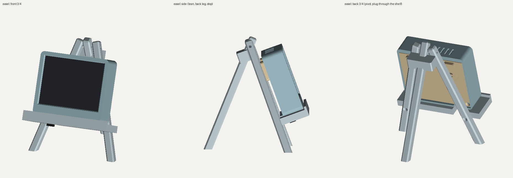

# Mezzotint case

A printable enclosure for a Pimoroni Inky wHAT (red) stacked on a Raspberry Pi 3 A+. Every part comes from `mezzotint_case.py` (build123d), and every dimension is a field in the `P` dataclass. Override any of them with a JSON file:

```bash
python mezzotint_case.py                 # defaults = the measured build below
python mezzotint_case.py my.json         # e.g. {"pi_front_z": 18.9, "win_overlap": 0.7}
python fitcheck.py                       # exact boolean clash check against stand-in hardware
python easel_check.py easel.png         # frame on the easel: clashes, tipping margin, renders
python render.py preview.png && python assembly.py assembly.png
```

Outside size: **96 × 83 × 28 mm**. The keyhole blocks add 4.5 mm behind it.



## Parts

| File | What it is | Print it |
|---|---|---|
| `mezzotint_fitring.stl` | The bezel plus the first 7 mm of wall | **Print this first** (about 20 min). The wHAT should drop in with a hair of play, and the image edges should sit just inside the window's bevel. |
| `mezzotint_body.stl` | Bezel and walls in one piece | Front face down on the bed. No supports. |
| `mezzotint_cover.stl` | Back plate with keyholes | Inside face (the one with the rings) down. No supports. |
| `mezzotint_easel_front.stl` | Easel front: two splayed legs, the pivot, and the stop for the back leg | Lies as exported, front faces on the bed. No supports. |
| `mezzotint_easel_back_leg.stl` | Easel back leg, which rises above the pivot between the front legs | On its side. No supports. |
| `mezzotint_easel_shelf.stl` | The shelf the frame stands on, with a notch for the power plug | Underside down. No supports. |

## Clear PETG settings

- **Nozzle** 240 °C, **bed** 80 °C, **part fan** 30–50 %. Dry the spool if it has been open a while; wet PETG strings and clouds.
- **Layer** 0.2 mm, **4 walls**. The 2.4 mm walls then print as solid perimeters, which looks much cleaner in clear than infill showing through.
- **Bottom layers: 11.** The whole 2.2 mm front plate becomes solid. Set the bottom surface pattern to **concentric**, so the bezel's texture follows the frame shape and looks deliberate.
- The **bed surface** sets the look of the bezel. A textured PEI sheet gives an even frosted mat. Smooth PEI or glass gives a glassier front. Use glue stick or a release agent on smooth PEI, because PETG can bond to it hard enough to take chips out.
- **Infill** 30–40 % gyroid for the easel; the other parts are almost all perimeters anyway.

## Hardware

- **2 × M3 × 8 countersunk screws** (ISO 10642 / DIN 7991). They cut their own thread into the 2.5 mm pilot holes.
- **4 × self-adhesive foam dots**, 6 mm across and 1.5–2 mm thick (EVA or PE foam). One goes in each ring on the cover. They press the Pi's screw heads lightly, which holds the whole stack against the bezel without loading the display glass.
- **A normal straight micro-USB cable.** The plug comes out through a slot in the bottom wall. The slot is open at the back, so the stack drops in with the plug already fitted.
- **Easel:** 1 × M3 × 35 screw with a nyloc nut (or a wing nut, which suits an easel) for the pivot, and 2 × M3 × 16 countersunk screws to fix the shelf to the legs.
- **2 wall screws** (#6 or 3.5–4 mm, with a head under 8 mm) and anchors, if you hang it.
- Reuse the Pi's own screws and standoffs.

## Assembly

1. **Peel the protective film off the display.** Its red pull tab would get pinched by the wall.
2. Plug the cable into the Pi.
3. Drop the wHAT/Pi stack into the body face-first, with the plug sliding down the slot in the bottom wall.
4. Stick the foam dots into the four rings on the cover.
5. Hook the cover's top edge under the lip, swing it closed, and fit the two screws.

**The easel.** Screw the shelf to the front of the legs; the screws go in from the back, countersunk. Slide the back leg between the leg tops and put the M3 × 35 through all three, snug but free to turn. Open the back leg until it rests on the stop behind the front legs, and it folds flat for storage. Stand the frame on the shelf with its back against the legs, and drop the plug through the shelf's notch. The cord hangs free between the legs.

The frame leans back 20°. With it on the shelf, the centre of mass is about 13 mm behind the front feet, so a light knock won't tip it forward (`easel_check.py` computes this).

To swap the SD card, take the cover off and lift the stack out. The card sits right against the wall so it can't be knocked, which also means you can't remove it with the stack in place.

## Measured dimensions

| | |
|---|---|
| wHAT board | 90 × 77 mm |
| Image area | 84.8 × 63.6 mm (400 × 300 px), 2.6 mm from the left edge and 2.3 mm from the top, scaled from a photo of a print (±0.4 mm). The bezel overlaps the image by 0.5 mm per side (`win_overlap`) to hide that tolerance. |
| Pi 3 A+ | 65 × 57 mm. It sits 4 mm from the wHAT's edge on the SD side and 6 mm from the top. The SD card ends flush with the wHAT's edge. |
| Stack depth | 20 mm from the front of the glass to the back of the Pi. Allow 2.5 mm behind that for solder tails and the SD card. |

If the fit ring shows the window is off, change `active_left` / `active_top` by the error and rebuild. If the cover rocks or the stack rattles, change the foam thickness; nothing needs reprinting.
